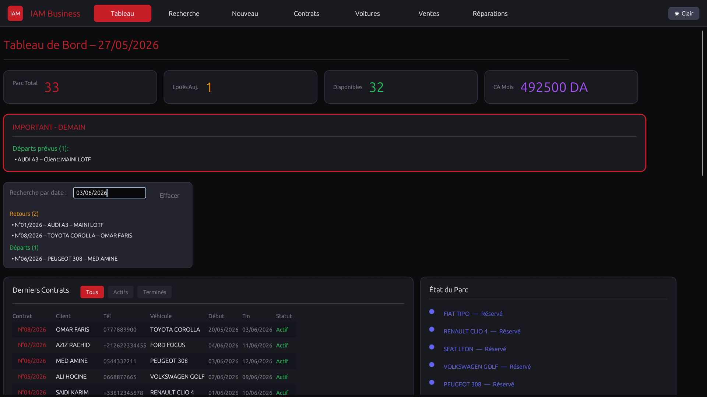
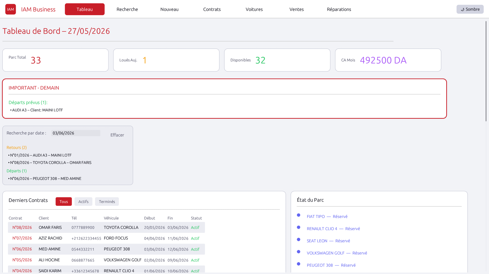
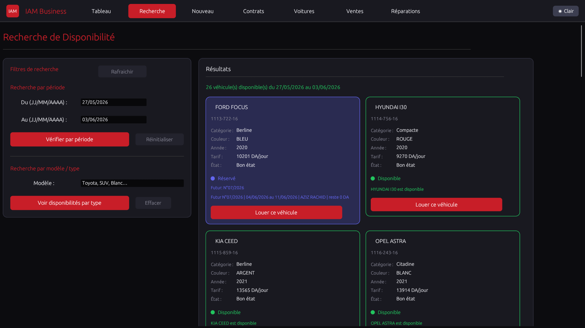
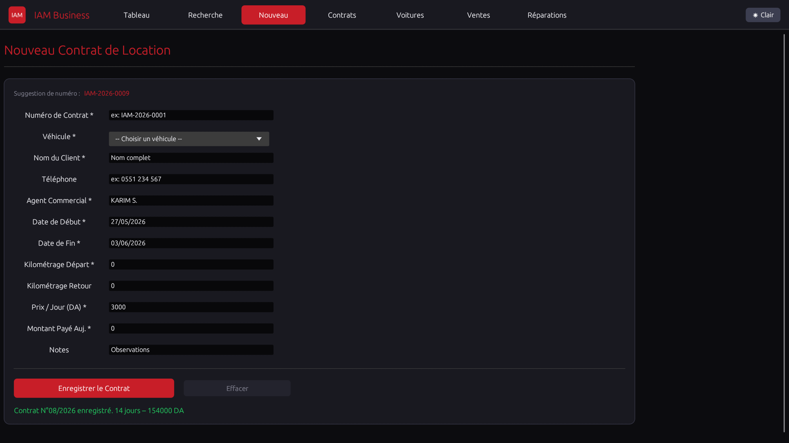

# IAM BUSINESS APP






IAM Business is a desktop application developed in Rust using the eframe/egui framework. It is designed to assist with the management of car rental operations. The application provides tools for handling contracts, vehicle inventory, financial reporting, maintenance logs, and vehicle sales tracking.

---

## Features

* **Contract Management:** Creation, tracking, and payment management for rental contracts.
* **Vehicle Availability:** Real-time visual dashboard for checking the status and availability of the fleet.
* **Fleet Management:** Tools to add, edit, and track the status of vehicles, including maintenance records.
* **Financial Reporting:** Management of rental income (encaissements) and business expenses (decaissements).
* **Maintenance Logs:** Tracking of repairs and technical service history for each vehicle.
* **Car Sales:** Lifecycle management for vehicles, from acquisition to final sale, including profit calculations.
* **Cross-Platform:** Built with Rust, ensuring compatibility on both Windows and Linux.

---

## Tech Stack

* **Language:** Rust
* **GUI Framework:** eframe / egui (Immediate Mode)
* **Data Persistence:** serde / csv
* **Date Handling:** chrono

---

## Getting Started

### Prerequisites

* [Rust](https://www.rust-lang.org/tools/install) installed on your machine.

### Installation

1. Clone the repository:
   ```bash
   git clone [https://github.com/yourusername/iam-business.git](https://github.com/yourusername/iam-business.git)
